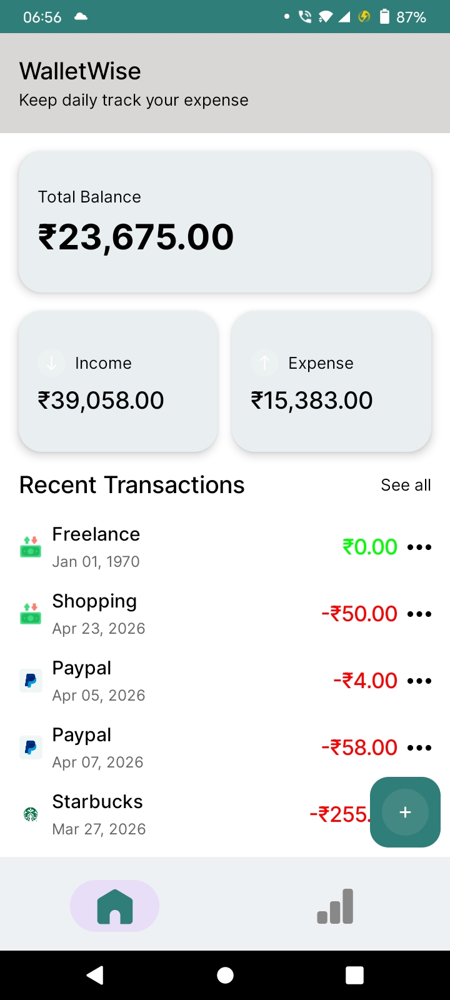
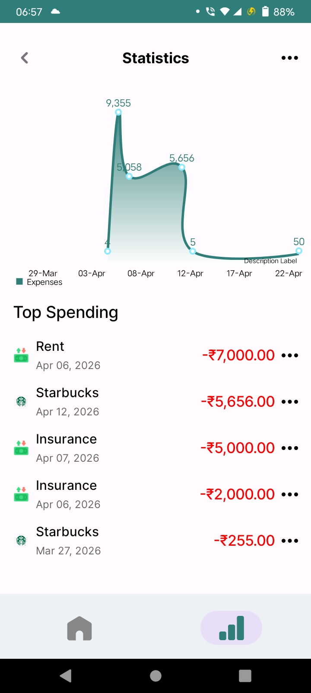
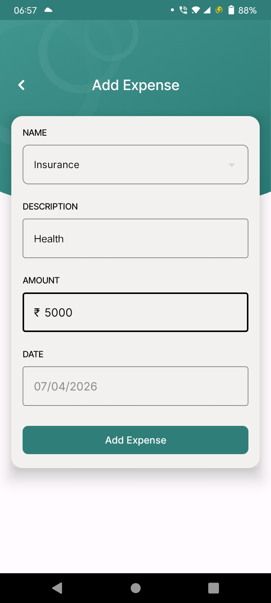
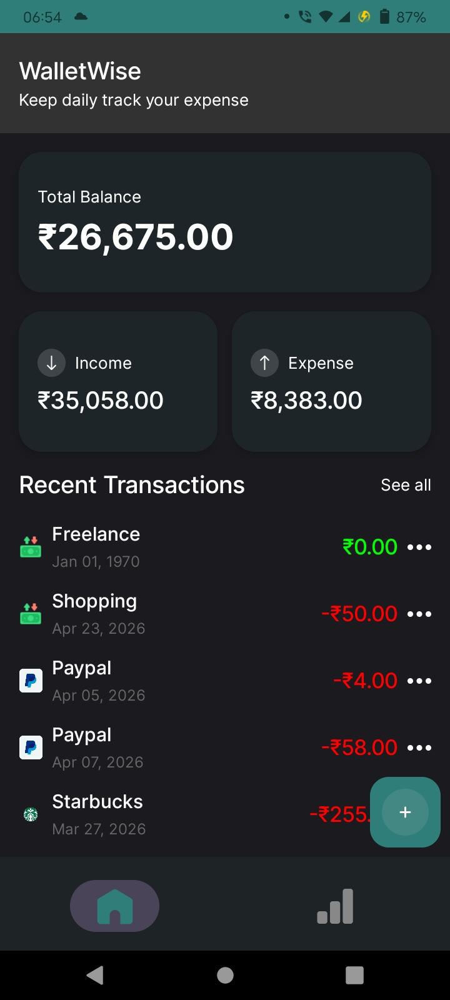
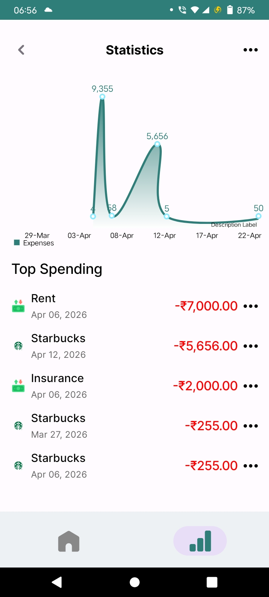
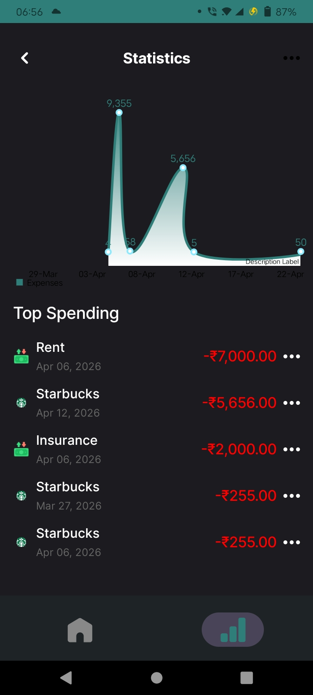
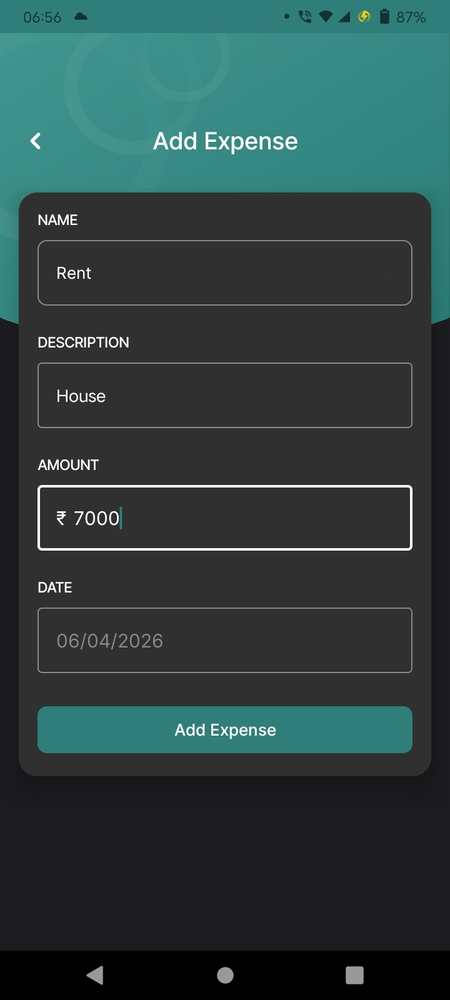

# 💰 WalletWise App

A modern Android application to manage daily finances by tracking income and expenses.  
Built using **Jetpack Compose** and **MVVM architecture**, the app focuses on clean design, smooth performance, and maintainable code structure.

## 🚀 Features

- ➕ Add Income and Expenses  
- 💳 View Total Balance  
- 📊 Categorized transaction tracking  
- 📃 Recent Transactions list  
- ⚡ Real-time UI updates  
- 💾 Offline data storage  

## 🛠️ Tech Stack

- **Kotlin**
- **Jetpack Compose**
- **MVVM Architecture**
- **Dagger Hilt (Dependency Injection)**
- **Room Database**
- **StateFlow / Flow**
- **Navigation Component**

## 📱 UI Highlights

- Clean and minimal design  
- Modern card-based layout  
- Smooth animations and interactions  
- User-friendly input flow

## 📸 Screenshots

### 🌞 Light Theme

  
  
  
  

### 🌙 Dark Theme

  
  
  
  

## 🏗️ Architecture

The project follows **MVVM (Model-View-ViewModel)** architecture:

- **View (Compose UI):** Displays data and handles UI interactions  
- **ViewModel:** Manages UI state and business logic  
- **Model (Room DB):** Handles local data persistence  

## 👨‍💻 Author

**Sejal Kamble**  
Android Developer  

## ⭐ Conclusion

This project demonstrates strong understanding of:

- Modern Android development  
- Clean architecture principles  
- UI development with Jetpack Compose  
- State management and data handling  

